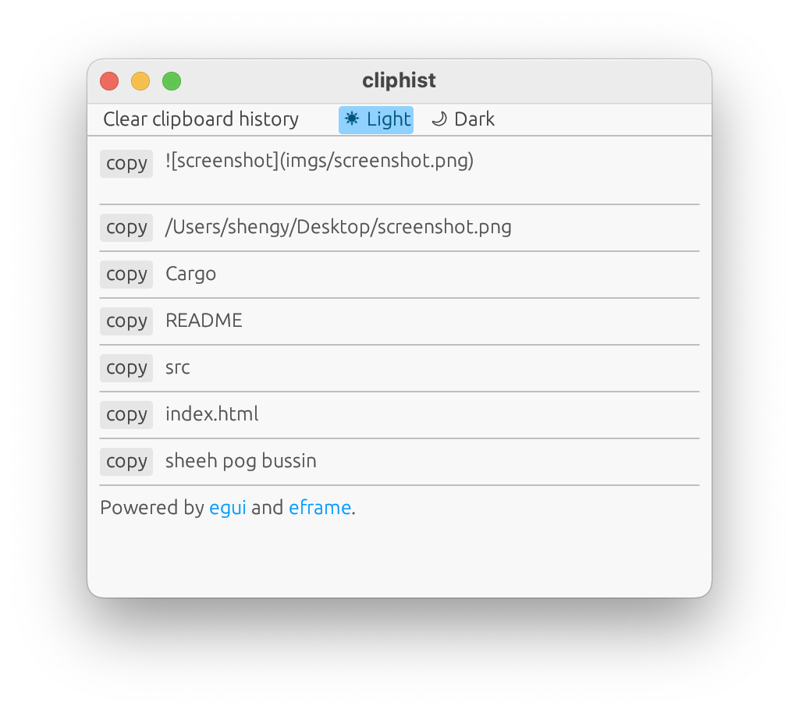

# Poorman's MacOS Clipboard History

A simple tool showing your clipboard history.

# How does it work

This tool polls every 500ms to check if there is any new
text inside your clipboard.
If so it writes a new file to `~/.cliphist/`

The GUI reads files from `~/.cliphist/` and displays them

